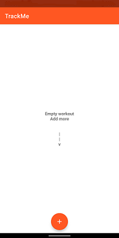
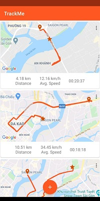
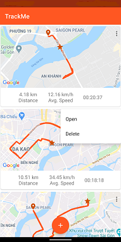
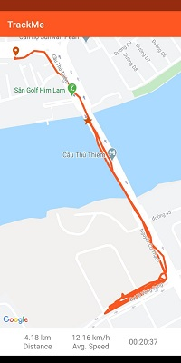
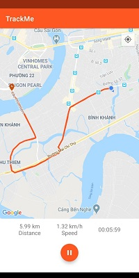
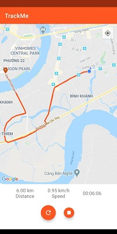
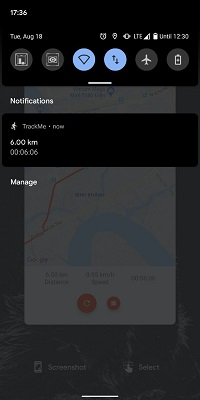

TrackMe 
=================
Record outdoor workout.<br>
App to practices with [Android Jetpack](https://developer.android.com/jetpack/components) and uses the [Kotlin](https://developer.android.com/kotlin) to develop.<br>

Screenshots
-----------









### GoogleMap API key

TrackMe uses the [GoogleMap API](https://developers.google.com/maps/documentation/android-sdk/overview) to show activity on map.
To use the API, you will need to obtain a developer API key from [Google Cloud Platform Console](https://cloud.google.com/console/google/maps-apis/overview).
Once you have the key, add this line to the `local.properties` file, either in root your project directory.

```
googleMap.apiKey=<YOUR_API_KEY>
```

Libraries Used
--------------

* [AppCompat][1] - Degrade gracefully on older versions of Android.
* [Android KTX][2] - Write more concise, idiomatic Kotlin code.
* [Data Binding][3] - Declarative bind observable data to UI elements.
* [LiveData][4] - Build data objects that notify views when the underlying database changes.
* [Navigation][5] - Handle everything needed for in-app navigation. (define to use)
* [Room][6] - Access your app's SQLite database with in-app objects and compile-time checks.
* [ViewModel][7] - Store UI-related data that isn't destroyed on app rotations. Easily schedule asynchronous tasks for optimal execution.
* [WorkManager][8] - Manage your Android background jobs.
* [Fragment][9] - A basic unit of composable UI.

Upcoming features
-------

[ ] Delete workout item
[ ] Open workout item

Reference
-------
I had been referencing architecture from [Sunflower project](https://github.com/android/sunflower)<br>

-------
Happy coding!

[1]: https://developer.android.com/topic/libraries/support-library/packages#v7-appcompat
[2]: https://developer.android.com/kotlin/ktx
[3]: https://developer.android.com/topic/libraries/data-binding/
[4]: https://developer.android.com/topic/libraries/architecture/livedata
[5]: https://developer.android.com/topic/libraries/architecture/navigation
[6]: https://developer.android.com/topic/libraries/architecture/room
[7]: https://developer.android.com/topic/libraries/architecture/viewmodel
[8]: https://developer.android.com/topic/libraries/architecture/workmanager
[9]: https://developer.android.com/guide/components/fragments